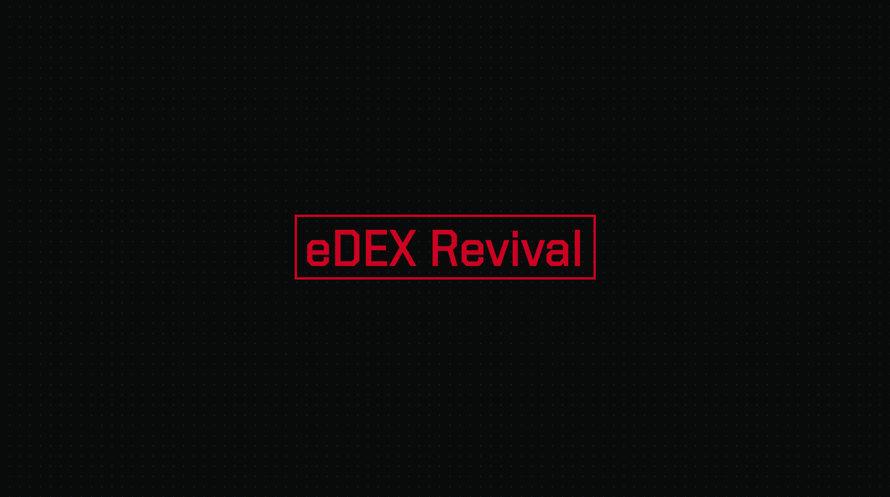
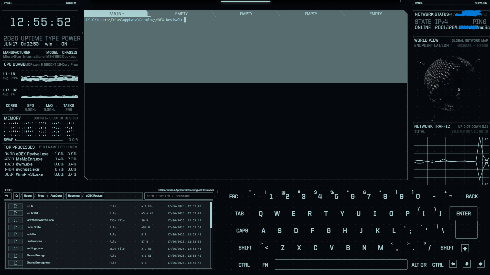
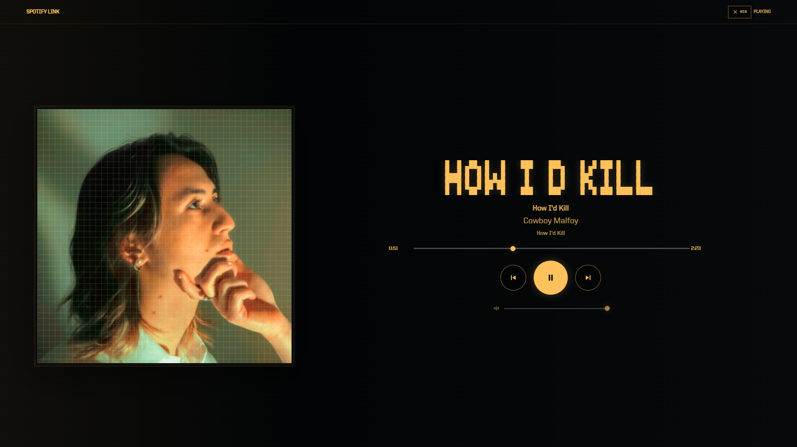
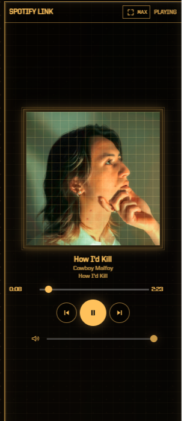
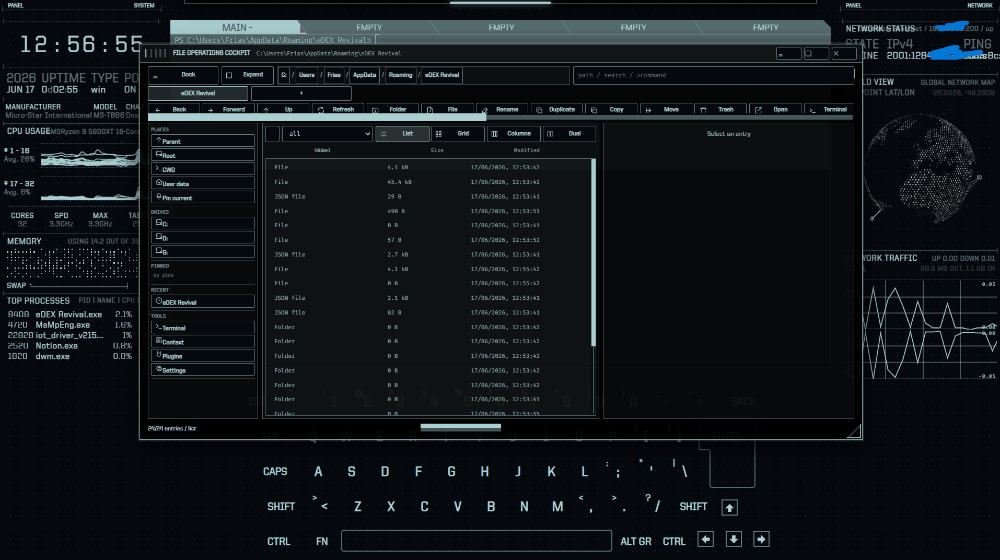
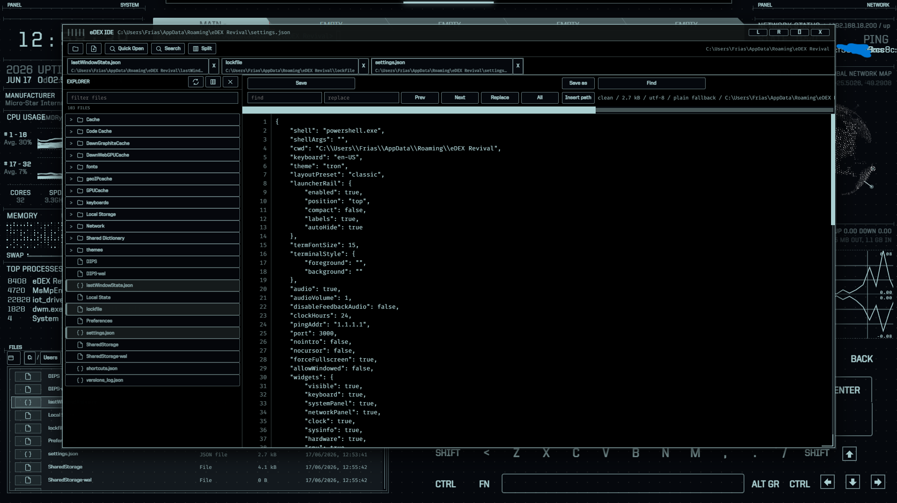
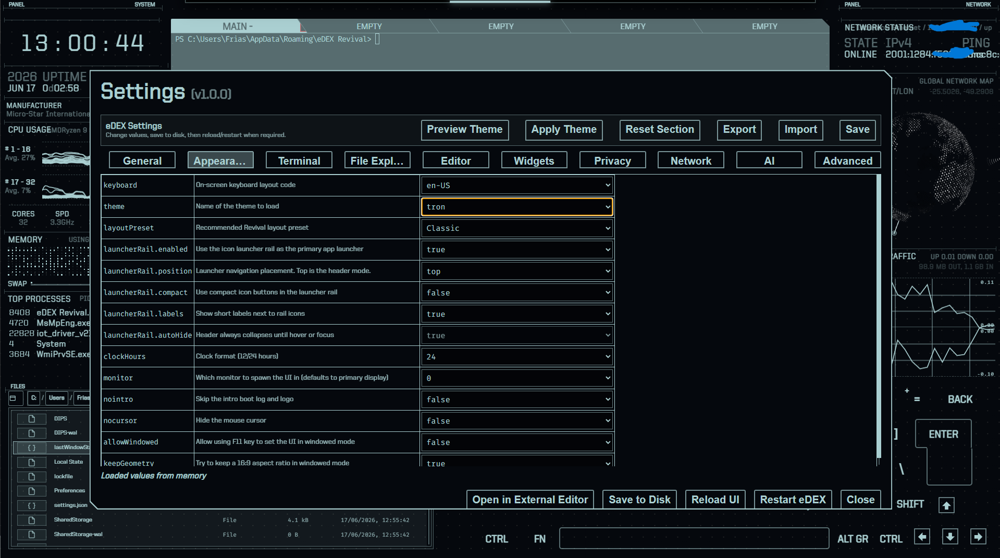
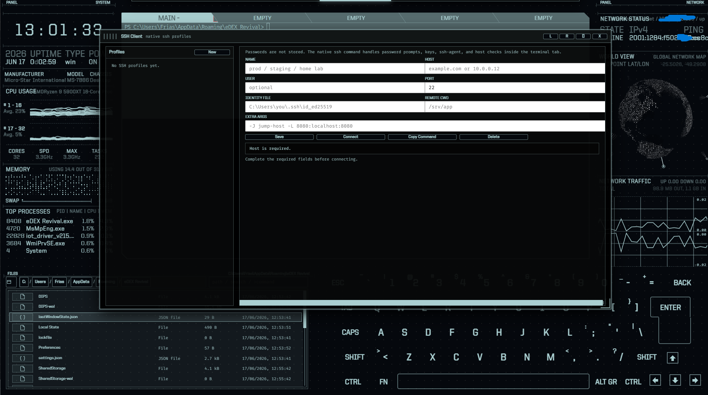
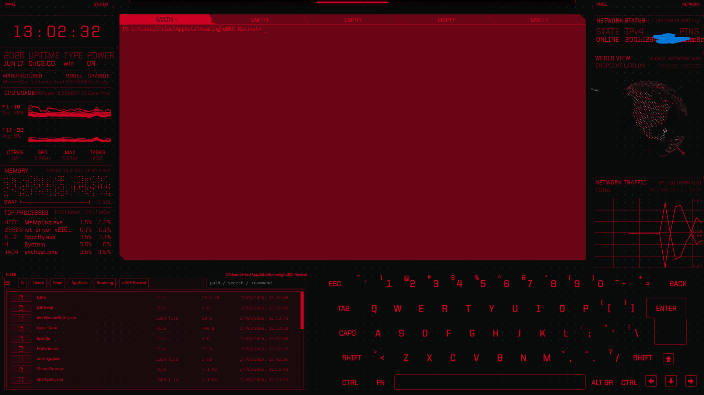

# eDEX Revival

<p align="center">
  
</p>

<p align="center">
  <a href="https://github.com/gabrielfriasw/edex-revival/releases"></a>
  <a href="LICENSE"></a>
  
  
  
</p>

eDEX Revival is a revived sci-fi terminal, system monitor, file cockpit, lightweight editor, SSH launcher, and local developer cockpit.

It is a fork and continuation of the original [eDEX-UI](https://github.com/GitSquared/edex-ui), created by Gabriel "Squared" Saillard. Revival development is maintained by Gabriel Frias.

<p align="center">
  
</p>

## What Changed

- Modernized Electron runtime and packaging for current Windows and Linux builds.
- Revival layout presets: Classic, Minimal, Developer, Privacy, and Cinematic.
- Auto-hide top launcher for Settings, Widgets, Explorer, Diagnostics, Editor, SSH, and Network Lens.
- Dual monitor mode with a configurable secondary display for Spotify focus, widgets, terminal, or a blank stage, including portrait/landscape intent and fullscreen startup.
- File Operations Cockpit with explorer, preview, Git-aware actions, batch operations, terminal-here flow, and resizable internal windows.
- Lightweight editor workbench with tabs, file sidebar, search, split view, save states, and safer file-open behavior.
- Native SSH profile client that opens sessions in terminal tabs without storing passwords, with guided SSH key setup and keepalive controls.
- Spotify Connect widget with user-owned Web API setup, PKCE OAuth, encrypted token storage when available, album art, playback controls, adaptive layout, optional album-art palette theming, fullscreen focus mode, and secondary-monitor routing.
- Native packaged update flow with background download, progress UI, restart/install action, and Settings controls.
- Terminal diagnostics and optional Error to Fix handoff for Codex or Claude CLI.
- Privacy controls for IP, interface name, geolocation, and globe/network modes.
- Session-only screen-share mode for masking sensitive paths, SSH/network labels, interface data, and geolocation during demos.
- Loopback-only terminal transport with per-session tokens for terminal WebSocket attachment.
- Settings save/import/export through main-process IPC with validation, backups, and atomic writes.
- Plugin docs, examples, and plugin error recovery.
- Terminal copy/paste shortcuts and tab close controls.

## Screenshots

### Spotify Focus Mode



### Spotify Widget

<p align="center">
  
</p>

### File Operations Cockpit



### Editor Workbench



### Settings Center



### SSH Client



### Theme Variants



## Install

Download builds from the [Releases](https://github.com/gabrielfriasw/edex-revival/releases) page.

Current release artifact names:

```text
eDEX-Revival-Windows-x64.exe
eDEX-Revival-Linux-x86_64.AppImage
```

Release binaries may be unsigned. Windows can show a SmartScreen warning until the app builds trust.
Unsigned builds use conservative update auto-download defaults; users can still check and download updates from Settings.

## Development

Use Node 24.x for clean installs and packaging.

Windows:

```powershell
npm run install-windows
npm start
```

Linux:

```bash
npm run install-linux
npm start
```

Windows and Linux are the supported packaging targets for this release.

## Packaging

Windows:

```powershell
npm run build-windows
```

Linux:

```bash
npm run build-linux
```

Build artifacts are written to `dist/`.

## Privacy And Error To Fix

Error to Fix is disabled by default. When enabled, eDEX Revival can prepare an editable, redacted prompt from the latest terminal diagnostic and hand it to a local Codex or Claude CLI command. It does not include a chat assistant, model downloads, or automatic command execution.

Privacy controls can hide IP address, network interface name, geolocation, and live globe/network lookup behavior. The Privacy preset applies those defaults in one step.

Screen-share mode is a session toggle in Settings Center. It does not persist by default, and while active it masks privacy-sensitive UI and blocks public IP/geolocation lookup.

## SSH

The SSH Client stores profile metadata only:

- profile name
- host
- user
- port
- identity file path
- remote cwd
- extra ssh args

Passwords are not stored. Authentication stays with your native `ssh` client, keys, ssh-agent, and terminal prompts.

The SSH Client can guide users through generating an Ed25519 key, copying the public key, installing it on a server, testing key login, and switching a profile to key-based authentication.

## Spotify

Spotify integration is user-owned. Each user creates a Spotify Developer app, selects `Web API`, adds the local Redirect URI shown in Settings, and pastes only the app Client ID. eDEX Revival uses Authorization Code with PKCE and does not need or store a Client Secret.

The Spotify widget can optionally recolor itself from the current album art palette. `spotify.dynamicPalette` supports `fullscreen`, `always`, and `off`; the palette is extracted locally from the already-rendered album art and is not persisted.

Requested Spotify scopes are limited to playback state, currently playing, and playback control:

- `user-read-playback-state`
- `user-read-currently-playing`
- `user-modify-playback-state`

## Documentation

- [Release notes](docs/revival-release-notes.md)
- [Contribution guide](docs/CONTRIBUTING-REVIVAL.md)
- [Plugin manifest docs](docs/plugins/manifest.md)
- [Revival changelog](CHANGELOG-REVIVAL.md)

## Credits

Original eDEX-UI:

- Gabriel "Squared" Saillard: original application, design direction, and source code.
- Seena's DEX-UI work inspired the original project.
- Rob "Arscan" Scanlon's ENCOM Globe powers the globe widget.
- IceWolf composed the original sound effects used by eDEX-UI.

Revival:

- Gabriel Frias: Revival ownership, packaging, UX refresh, developer cockpit, SSH flow, privacy controls, docs, and release maintenance.

See [NOTICE.md](NOTICE.md) for attribution details.

## License

eDEX Revival is distributed under GPL-3.0, the same license as the original eDEX-UI project. Keep `LICENSE` and attribution notices intact when redistributing modified versions.
